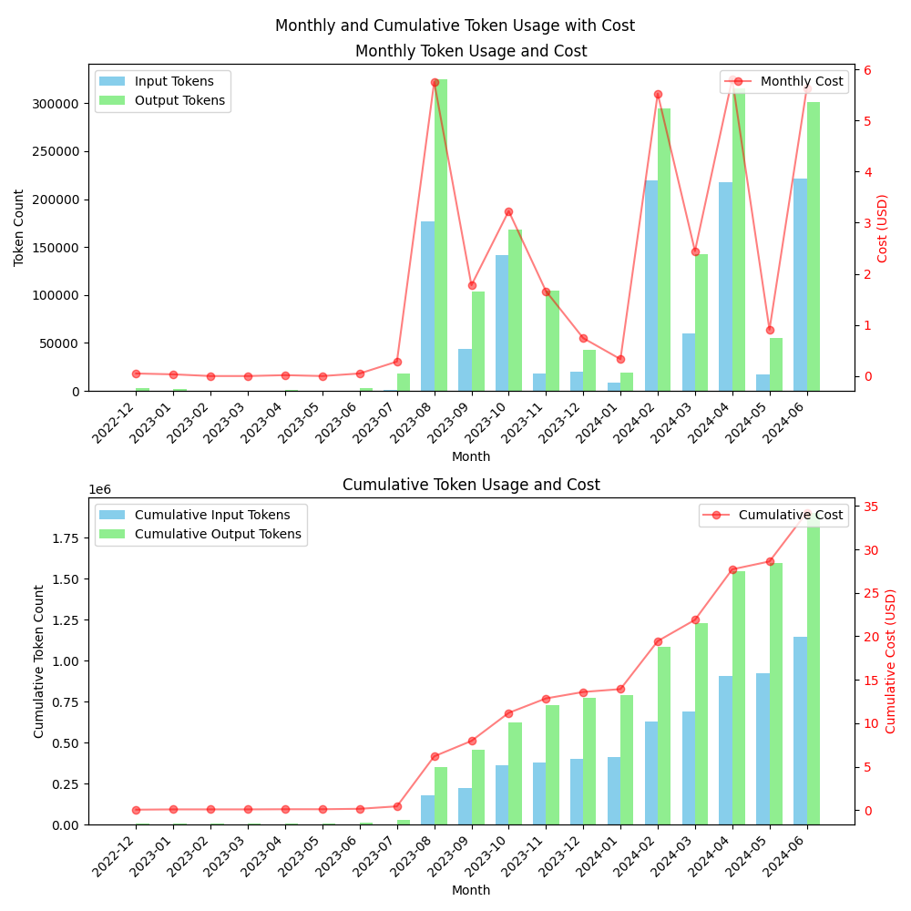

# ChatGPT API Cost Calculator

## Overview

This project provides a simple tool to help users make informed decisions about whether to opt for the ChatGPT API or a monthly subscription. By analyzing your ChatGPT previous usage data, it calculates and visualizes token consumption and 
associated costs, offering valuable insights for cost-effective decision-making.

## Features
- Token counting using OpenAI's official tokenizer
- Monthly and cumulative token usage visualization
- Cost calculation based on current API pricing
- Comparative analysis between API usage and subscription costs
- Easy-to-read graphs for quick decision-making

## Example Output

Here's an example of the visualization produced by this tool:



This graph shows monthly token usage and associated costs, helping you visualize your ChatGPT usage patterns over time.


## Installation

1. Clone this repository:

```bash
git clone https://github.com/riparise/chatgpt-api-cost-calculator.git cd chatgpt-api-cost-calculator
```

2. Install the required dependencies:

```bash
pip install -r requirements.txt
```

## Usage

1. Export your ChatGPT data:
   - Go to [ChatGPT Data Controls](https://chatgpt.com/#settings/DataControls)
   - Click on "Export data"
   - Download and extract the zip file

2. Copy the `conversations.json` file to the `./conversation` directory in this project.

3. Run the script:
```bash
python main.py
```
Alternatively, you can use your favorite IDE to run the script.

4. The script will generate two graphs:
   - Monthly token usage and cost
   - Cumulative token usage and cost

5. Use these visualizations to compare your usage patterns with the cost of a monthly subscription and make an informed decision.

## Customization

You can adjust the `COST_INPUT_TOKEN`, `COST_OUTPUT_TOKEN` and image processing costs in the script to reflect current API pricing or to perform what-if analyses. The 
most current pricing information can be found on the [OpenAI pricing page](https://openai.com/api/pricing/).


## Contributing

Contributions to improve the calculator or extend its functionality are welcome. Please feel free to submit pull requests or open issues for discussion.

## License

This project is open-source and available under the MIT License. See the [LICENSE](LICENSE) file for more details.

## Disclaimer

This tool provides estimates based on your usage data and current pricing information. Always refer to OpenAI's official pricing and terms for the most up-to-date and accurate information when making decisions about API usage or subscriptions.

## Acknowledgements

- This project uses the `tiktoken` library provided by OpenAI for accurate token counting.
- Thanks to the open-source community for inspiration and support.